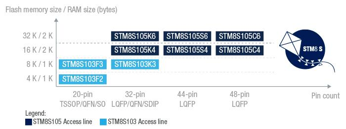

# [STM8S103](https://github.com/SoCXin/STM8S103)

 

Kingdom(K) - Dividion(D) - Class(C) - Order(U) - Family(F) - Genus(G) - Species(P)

#### [Vendor](https://github.com/SoCXin/Vendor)：[ST](https://github.com/SoCXin/ST)
#### [Core](https://github.com/SoCXin/STM8)：[STM8](https://github.com/SoCXin/STM8)
#### [Level](https://github.com/SoCXin/Level)：16MHz 

## [STM8S103描述](https://github.com/SoCXin/STM8S103/wiki) 

[STM8S103](https://github.com/SoCXin/STM8S103)基于专有16 MHz内核，具有全套定时器、接口（UART、SPI、I2C）、10位ADC、内部和外部时钟控制系统、看门狗、自动唤醒单元和集成式单线调试模块。

 

[STM8S103](https://github.com/SoCXin/STM8S103)和[STM8S003](https://github.com/SoCXin/STM8S003)的主要区别是Flash的擦写次数和EEPROM的容量和读写次数

* TSSOP20封装

 

### [收录资源](https://github.com/SoCXin/STM8S103)

* [文档](docs/)
* [资源](src/)

#### [外部资源](https://github.com/SoCXin)

* [STM8CubeMX](https://www.st.com/zh/development-tools/stm8cubemx.html)
* [SDCC](https://github.com/SoCXin/sdcc)
* [OS-Q](https://github.com/OS-Q/H02)

### [选型建议](https://github.com/SoCXin)

[STM8S103](https://github.com/SoCXin/STM8S103)适用于开发板和原型验证，相较于[STM8S003](https://github.com/SoCXin/STM8S003) 具有耐擦写的存储空间

###  [SoC芯平台](http://www.SoC.Xin) 
